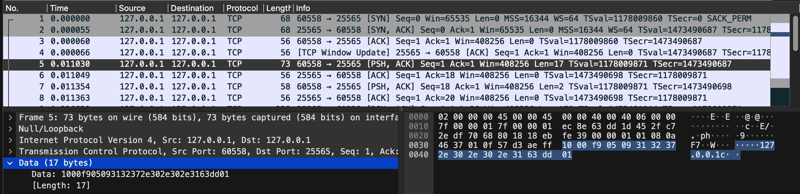

# Server list ping

Uses [Cloudflare Worker's TCP API](https://blog.cloudflare.com/workers-tcp-socket-api-connect-databases/) to get the server-list player
count, message-of-the-day, and player sample. This is the same data you'd see on the
multiplayer server list.

This light-weight approach parrots the same packets sent by the Notchian client:

1. Server-bound [handshake](https://wiki.vg/Server_List_Ping#Handshake)
2. Server-bound [status request](https://wiki.vg/Server_List_Ping#Status_Request)
3. Client-bound [status response](https://wiki.vg/Server_List_Ping#Status_Response)

Using what wiki.vg publishes we can use `Buffer`, from the standard library, and `leb`, a third-party package for working with base 128 little endian bytes.

Wireshark then let's us verify and debug our work:



```
notchian client  10 00 f9 05 09 6c 6f 63 61 6c 68 6f 73 74 63 dd 01
worker client    10 00 fa 05 09 6c 6f 63 61 6c 68 6f 73 74 63 dd 01
```

For example, this helped me realize a mismatch between using little and big endian byte order for the server port in the handshake packet!
